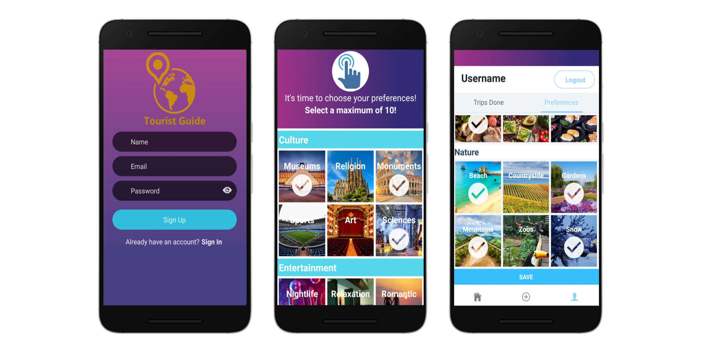
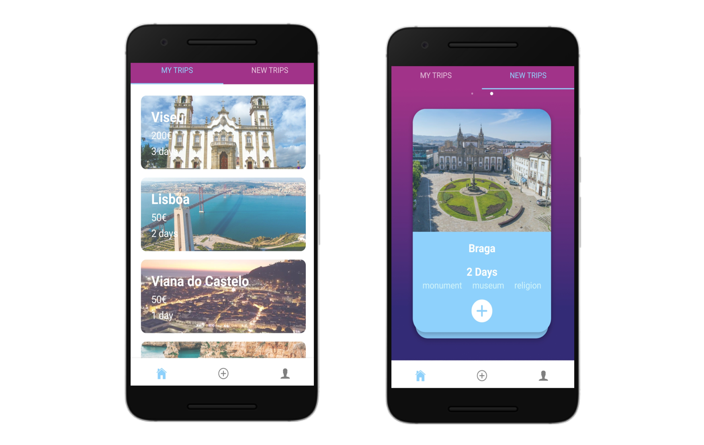
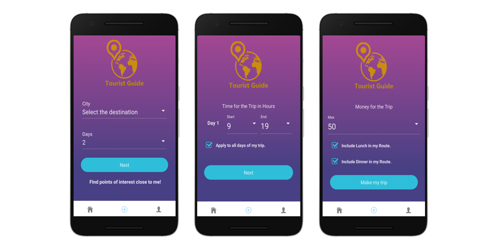
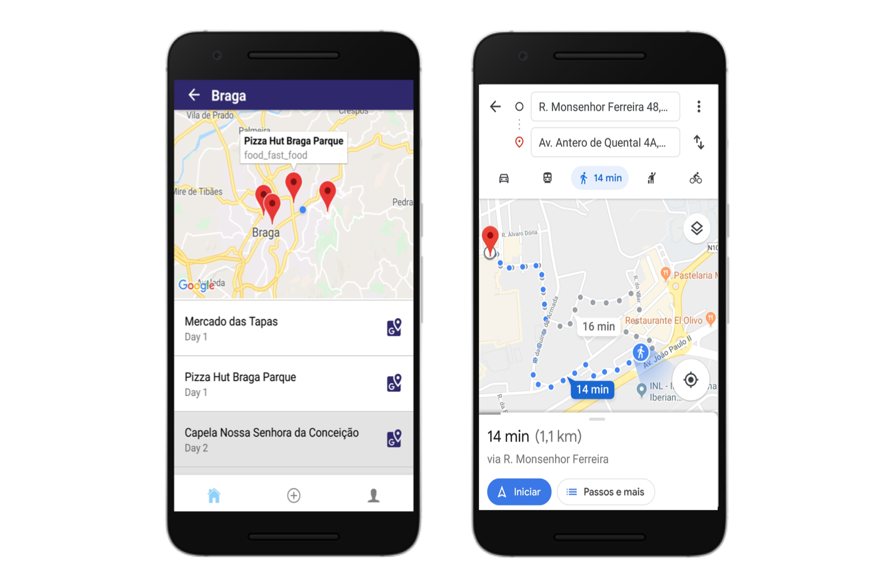
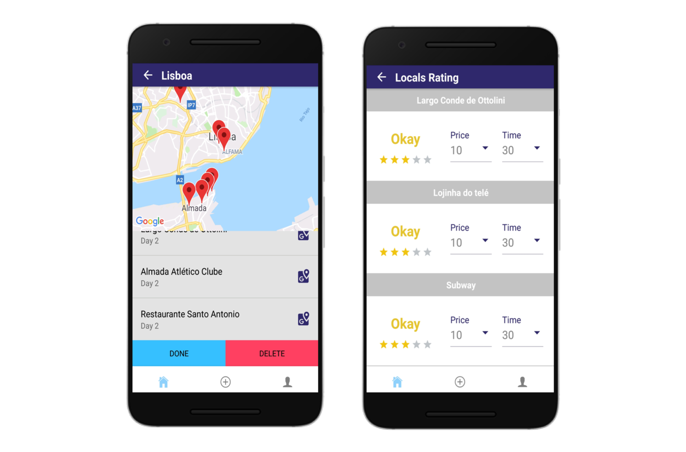
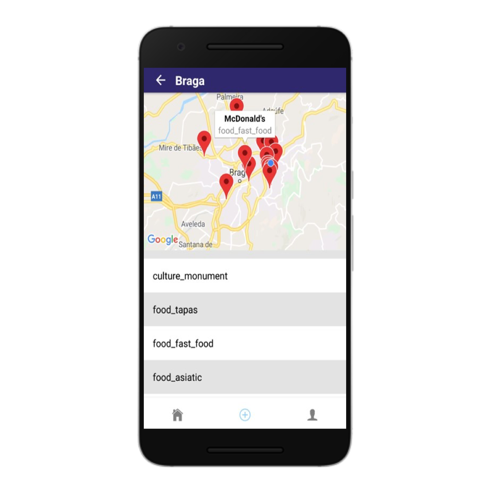

# Intelligent Tourist Guide (Route Planner)

Many tourists use the services of tour guides when they want to visit a new city. These have a pre-established route, in which drag a group of people to the places they find most relevant. In these groups, each person has their preferences that are often not reflected in the routes created by these entities. Thus, they may end up visiting places that are not of interest and leaving out others that are more appealing.

Taking this problem as a starting point, we intend to create a system in which each person feels that their tourist experience is unique and personalized. This system identifies itself as a mobile application that allows the creation of a tourist route in a city, based on the profile of each user, through Machine Learning techniques.

- **Developed Application:**

	- Getting Preferences 
	

	- Travel List
	

	- Travel Planning
	

	- Make Travel
	

	- End Trip
	

	- Display Points of Interest
	

